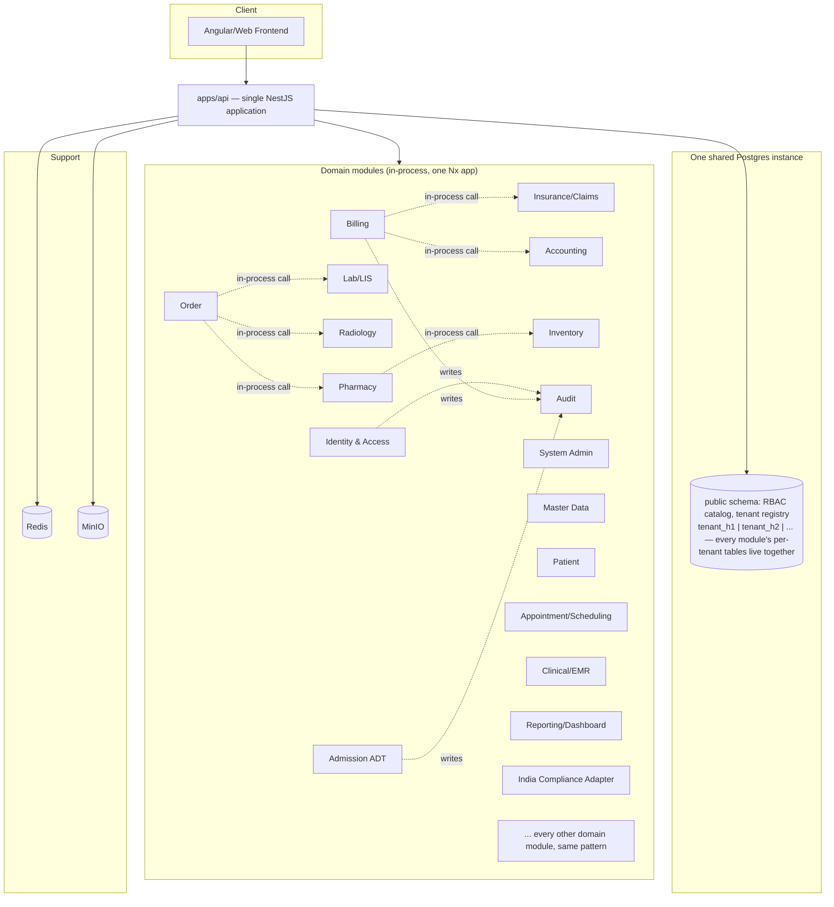

# PRD: Vaidya — Hospital Management EMR Modular Monolith Re-Platform

**Product name:** Vaidya (वैद्य, Sanskrit for "physician") — chosen 2026-08-14; no Ayurveda/telemedicine brand or government platform owns it outright, unlike "Arogya" (Aarogya Setu) or "Sanjeevani" (eSanjeevani, MoHFW's telemedicine platform), both of which were rejected for that reason.
**Brand colors:** `#006D77` (deep teal, primary/accent — matches the logo mark) on `#F0FDFD` (near-white, page/surface background) — chosen 2026-08-14; `#006D77` with white text is 6.1:1 contrast, clears WCAG AA for both body and large text. No secondary/semantic (success/warning/error) colors chosen yet — needed once the frontend repo (PRD §3/§9.4, not yet split out) starts building real UI.
**Status:** Draft v1
**Source system:** `old/hospital-management-emr` (Danphe EMR — ASP.NET Core 2.0/net461 monolith, EF6/EF Core, MSSQL, Angular/TS frontend, ~40 modules, live in 50+ hospitals across India/Nepal/Bangladesh)
**Decisions locked in for this PRD:** stack = Node.js + NestJS + TypeScript, one modular monolith application (`apps/api`); scope = phased rollout, greenfield build; deployment = Docker Compose, **hybrid multi-tenant hosted (default) + single-tenant on-prem** (§9); tenancy isolation = schema-per-tenant within one shared Postgres instance for the whole platform (§4).
**Architecture revised 2026-07-31** from an initial microservices design (~36 independently-deployed services, one dedicated Postgres instance each) to a single modular monolith — full rationale in `../superpowers/specs/2026-07-31-modular-monolith-architecture-design.md`. §11's "Over-decomposition for single-VM ops" risk flagged this exact possibility before Phase 1 even started ("a modular monolith could achieve G1–G3 with far less operational complexity"); it's being exercised now, early, rather than deferred to a post-Phase-1 consolidation. This does **not** reintroduce the old system's actual root problem (§1) — unenforced bounded contexts and free-for-all shared-DB access. Strict per-module data ownership and no-cross-module-raw-SQL are kept; only the *physical* process/DB-instance separation is dropped, in favor of *logical* boundaries (Nx module-boundary lint rules, code review) — see §10/§11 for the isolation trade-off this implies.
**How `old/` is used:** `old/hospital-management-emr` is a reference for domain scope and known pain points only — not a parity contract. This is a greenfield design; modules, boundaries, and even whether a given old module exists at all are free to change wherever the new design is better served by diverging.
**Target market:** India — this build is not for the old system's Nepal/Bangladesh markets. Country-specific compliance (§5.7) is scoped to India (GST, with ABHA/PM-JAY/ESI-PF as later additions), not Nepal.
**Confirmed scale & infra (2026-07-30 grilling session):** hosted multi-tenant mode targets **10-20 hospital tenants** on **one self-owned, in-house server hosted in India** (not a rented cloud VM) — see §9. Backend lives in one monorepo with affected-only CI/CD; frontend is a separate greenfield repo, framework TBD.

---

## 1. Problem Statement

Danphe EMR is a single ASP.NET Core deployable (`DanpheEMR.csproj`) referencing six shared component libraries (`Core`, `Security`, `ServerModel`, `DalLayer`, `AccTransfer`, `Sync`) with ~120 controllers across ~40 business modules, all against one MSSQL database pair (Admin-Db, EMR-Db). This produces:

- **Coupled deploys** — a Pharmacy fix requires redeploying Billing, Payroll, and Lab in the same binary.
- **Single DB contention** — Billing, Inventory, and Payroll all hammer the same MSSQL instance; no per-domain scaling.
- **Framework EOL risk** — net461/ASP.NET Core 2.0 and EF6 are out of support; `TargetFramework net461` + `EntityFramework 6.2.0` alongside `EntityFrameworkCore 2.0.0` is a legacy hybrid.
- **Country-specific logic baked into core** — `DanpheEMR.Sync` (IRD Nepal, SSF Nepal) and `MedicareModels` are compiled into the same deployable as generic clinical modules, blocking reuse in non-Nepal hospitals.
- **No clear bounded contexts** — `ServerModel` has 39 flat model folders (Billing, Lab, Radiology, Payroll, Fraction, CSSD, Vaccination, DICOM, …) with no enforced ownership boundary.

## 2. Goals / Success Criteria

| # | Goal | Success Criteria |
|---|------|-------------------|
| G1 | Modular boundaries per domain | Each domain is its own Nx library with its own entities; no module imports another module's internals directly (enforced by Nx module-boundary lint rules). Deployed together as one application — structurally separable later if a domain ever needs to be split out, but not independently deployed today |
| G2 | Data ownership per bounded context | Each domain owns its own tables inside the one shared platform Postgres instance; no cross-domain direct repository/entity access — only via the owning domain's exported service methods (in-process calls, not a network API) |
| G3 | Reference-scope coverage, not parity | Every domain worth keeping from `old/` (see §5) has a named owning module in the target architecture — but modules can be merged, dropped, or redesigned where the old shape doesn't hold up |
| G4 | Dual deployment modes, one codebase | The identical application image runs in a shared **multi-tenant hosted** deployment (many hospitals, one stack) or a **single-tenant on-prem** deployment (one hospital, one VM, as today) — the only difference is how many tenant schemas exist in the one shared Postgres instance (§9) |
| G5 | Country-specific compliance isolated | India tax/regulatory logic (GST invoicing first; ABHA/PM-JAY/ESI-PF later) lives in a pluggable adapter module, not folded into core clinical modules — isolated the same way even though every current tenant is Indian, so it stays replaceable if that ever changes |
| G6 | Phased build sequence | Modules ship in dependency order (§8) so each phase is independently demoable/testable within the one running application; no requirement to interoperate with the legacy `old/` app in production |
| G7 | Multi-tenant by default | New hospitals onboard as one new schema in the shared Postgres instance, not a new stack and not new schemas fanned out across dozens of instances — avoids re-provisioning infrastructure per customer (§9) |

## 3. Non-Goals

- Byte-for-byte replication of `old/` workflows or schemas — it's a reference for scope and lessons learned, not a spec to satisfy.
- Multi-region/multi-cloud active-active — out of scope; the hosted mode (§9.1) is one self-owned, in-house server in one location, not a distributed platform.
- Choosing a new frontend framework — confirmed greenfield rebuild (§8, not an evolution of the old Angular 7 app), but the specific stack is a separate decision outside this PRD; it lives in its own repo (§9.4).
- Hospital-chain / multi-site cross-hospital reporting — no chain customers among the confirmed 10-20 tenants; not designed for. Revisit only if a real chain customer appears (additive later, not a hard blocker now).
- Live migration between on-prem and hosted deployment modes — each hospital commits to one mode at deployment time; a mode switch is possible only as an ad hoc `pg_dump`/`pg_restore` (the schema shape is identical, §9.2), never a supported, tested, or SLA'd feature.
- ABHA/ABDM, PM-JAY, and ESI/PF integration — real India-market needs, but deferred past the GST-first India Compliance Adapter (§5.7) until specific tenants require them.

## 4. Target Tech Stack

| Concern | Choice | Notes |
|---|---|---|
| Application framework | NestJS (Node 20 LTS, TypeScript), **one application** (`apps/api`) | DI and module boundaries map cleanly to bounded contexts even without a network hop between them; Nx module-boundary lint rules (tag-based `enforce-module-boundaries`) keep domain libs from importing each other's internals |
| Inter-module calls | Direct in-process NestJS DI (one domain module injects another's exported service) | No REST/gRPC/event hop needed between domains that live in the same process; a domain's public surface is its exported service class, not a network contract |
| Async/eventing | None required for Phase 0/1 — dropped from the required stack (was RabbitMQ under the earlier microservices design) | YAGNI: nothing in the codebase used it yet even under the old design (`@hospital/audit-emitter` is already an in-process TypeORM subscriber, not a bus consumer). Revisit only if a genuine cross-process async need appears (e.g. Notification module's email/SMS dispatch) — tracked as an open question, §12 |
| Database | PostgreSQL, **one shared instance for the whole platform**, and **within that instance, one Postgres schema per hospital tenant** | Single isolation axis now: tenant boundary = separate schema (G7). Domain/module boundary is logical (lint + code review), not physical — see the isolation trade-off in §10/§11. Onboarding hospital #200 adds one schema to the one instance, not one schema to each of dozens of instances |
| Tenant resolution | `hospitalId` JWT claim → schema name (`tenant_<hospitalId>`), resolved per-request by a shared `@hospital/tenant-context` middleware that sets the TypeORM/Postgres connection's `search_path` before any query runs | Same mechanism in both deployment modes (§9) — in on-prem single-tenant mode there's simply always one schema to resolve to |
| Cache/session | Redis | Session store, rate limiting, read-through cache for Master Data |
| Object storage | MinIO (S3-compatible) | DICOM images, PDF reports, Excel exports — replaces local filesystem writes the old app does under `wwwroot` |
| Auth | Identity & Access module issuing JWT (access + refresh), RBAC claims ported from `DanpheEMR.Security/RBAC` | The application's own guard validates the JWT directly on each request (`@hospital/auth-guards`, in-process) — no separate gateway process forwarding claims over a network |
| Ingress | The application itself is the single ingress point (`apps/api`'s own controllers) | No separate API Gateway/BFF process — with one deployable, there's nothing left for a gateway to route *between*. Still owns rate limiting and JWT validation, just in-process rather than as a network hop |
| Containerization | Docker + Docker Compose | One `docker-compose.yml` per deployment — either the hosted multi-tenant stack or a single hospital's on-prem VM, per §9. One application container instead of ~36 |
| Observability | OpenTelemetry + Prometheus + Grafana + Loki, all in-stack alongside the application | Old system has no distributed tracing; this is a net-new NFR (see §10) — simpler now with one process to instrument instead of ~36 |

## 5. Module Decomposition (informed by `old/` modules)

Each module below is one **DDD bounded context**: it owns its own aggregate roots, ubiquitous language, and persistence (its own tables inside the one shared platform Postgres instance, §4/G2), and is reachable only through its own exported service methods — no shared domain model, no direct cross-module entity/repository access, no other module's code importing its entities directly. Grouped by domain, with the old-system source that motivates each boundary where one exists — this is a reference map, not a 1:1 port (G3); phase assignment is in §8.

### 5.1 Platform / Cross-Cutting Modules

| Module | Old-system origin | Responsibility |
|---|---|---|
| **Identity & Access** | `DanpheEMR.Security` (RBAC), `AccountController.cs` | Login, JWT issuance, RBAC roles/permissions, session management — role model detailed in §6 |
| **Master Data** | `ServerModel/MasterModels`, `Core/Lookups`, `Core/Parameters`, `Controllers/Master`, `Controllers/Core` | Hospital-wide lookups: departments, wards, item catalogs, code tables |
| **System Admin** | `ServerModel/SystemAdminModels`, `Controllers/SystemAdmin` | Tenant/hospital config, module toggles, license, **tenant provisioning** — onboarding a new hospital is one in-process operation that creates the tenant record and every other module's `tenant_<hospitalId>` schema in the same shared Postgres instance |
| **Notification** | `ServerModel/NotificationModels`, `Controllers/Notification`, SendGrid dep | Email/SMS dispatch, templated notifications |
| **Document & Print** | `Print/`, iTextSharp/EPPlus/Syncfusion/OpenXml deps, `ServerModel/StickerModels` | PDF generation, Excel export, label/sticker printing |
| **Reporting & Dashboard** | `ServerModel/ReportingModels`, `Controllers/Reporting`, `Controllers/Dashboard` | Cross-domain read-model aggregation, government reporting exports. Ships in two slices (§8): a minimal **event archiver** subscribing in-process to domain events from Phase 1 onward, and the full aggregation/dashboard UI querying that archive, in Phase 6 |
| **Audit** | `Audit.EntityFramework` / `Audit.NET.SqlServer` / `Audit.WebApi.Core` deps | Centralized audit trail — subscribes in-process to entity save/remove events via `@hospital/audit-emitter` (already built) and persists a structured, queryable audit log |

### 5.2 Patient & Care Delivery Modules

| Module | Old-system origin | Responsibility |
|---|---|---|
| **Patient** | `ServerModel/PatientModels`, `Controllers/Patient` | Registration, demographics, patient master |
| **Appointment/Scheduling** | `ServerModel/AppointmentModels`, `SchedulingModels`, `Controllers/Appointment`, `Controllers/Scheduling`, `Controllers/Doctors` | Appointment booking, doctor schedules, visit summaries |
| **Admission (ADT)** | `ServerModel/AdmissionModels`, `Controllers/Admission` (incl. `DischargeSummaryController`) | Admission/discharge/transfer, discharge summaries |
| **Clinical/EMR** | `ServerModel/ClinicalModels`, `MedicalRecords`, `Controllers/Clinical`, `Controllers/MedicalRecords`, `Vaccination` | Clinical notes, vitals, medical records, vaccination records |
| **Nursing** | `Controllers/Nursing` | Nursing tasks, MAR (medication administration record) |
| **Emergency** | `ServerModel/EmergencyModels`, `Controllers/Emergency` | ER intake, triage |
| **OT (Operation Theatre)** | `ServerModel/OtModels` | Surgery scheduling, OT notes |
| **Maternity** | `ServerModel/MaternityModels` | Labor/delivery records |
| **CSSD** | `ServerModel/CSSD` | Sterile supply tracking (instrument lifecycle) |
| **Ward Supply** | `ServerModel/WardSupplyModels`, `Controllers/WardSupply` (incl. `SubstoreBL`) | Ward-level sub-store stock, requisition to Inventory |

### 5.3 Orders & Diagnostics Modules

| Module | Old-system origin | Responsibility |
|---|---|---|
| **Order** | `Controllers/Order` (`OrdersController`, `OrderView`) | Central order placement, routes to Lab/Radiology/Pharmacy, order status |
| **Lab (LIS)** | `ServerModel/LabModels`, `LISModels`, `Controllers/Lab` | Test catalog, sample tracking, results, lab report export |
| **Radiology** | `ServerModel/RadiologyModels`, `Controllers/Radiology` | Imaging orders, report generation |
| **DICOM** | `ServerModel/DICOMModels`, `Controllers/DicomViewer` | DICOM image ingest/viewer integration (proxies to PACS) |

### 5.4 Pharmacy & Inventory Modules

| Module | Old-system origin | Responsibility |
|---|---|---|
| **Pharmacy** | `ServerModel/PharmacyModels`, `Controllers/Pharmacy/*` (Sales, Credit, CreditNote, Rack, Dashboard), `Controllers/Dispensary` | Drug dispensing, sales, credit notes, rack/bin management |
| **Inventory** | `ServerModel/InventoryModels`, `Controllers/Inventory/*` | Stock, goods receipt, vendor/company master, inventory settings |
| **Fixed Asset** | `ServerModel/FixedAssetModels` | Asset register, depreciation |

### 5.5 Billing, Insurance & Finance Modules

| Module | Old-system origin | Responsibility |
|---|---|---|
| **Billing** | `ServerModel/BillingModels`, `Controllers/Billing/*` (Billing, Deposit, Return, Settlement, IpBilling) | Charge capture, invoicing, deposits, settlements |
| **Insurance & Claims** | `ServerModel/InsuranceModels`, `ClaimManagementModels`, `MedicareModels`, `ExtReferralModels`, `Controllers/Insurance` | Government/private insurance verification, claims lifecycle, external referrals |
| **Accounting** | `ServerModel/AccountingModels`, `Controllers/Accounting/*`, `DanpheEMR.AccTransfer` | Ledger mapping, journal entries, financial reports |
| **Verification** | `ServerModel/VerificationModels`, `Controllers/Verification` | Payer/eligibility verification workflow |

### 5.6 HR & Payroll Modules

| Module | Old-system origin | Responsibility |
|---|---|---|
| **Employee** | `ServerModel/EmployeeModels`, `Controllers/Employee` | HR records, employee master |
| **Payroll** | `ServerModel/Payroll`, `Controllers/Payroll` | Salary computation, payslips |
| **Fraction & Incentive** | `ServerModel/FractionModels`, `IncentiveModels`, `Controllers/Fraction`, `Controllers/Incentive` | Revenue-share/designation-based fraction calculation, doctor incentives |

### 5.7 Country-Specific Compliance (pluggable adapter)

| Module | Old-system origin | Responsibility |
|---|---|---|
| **India Compliance Adapter** | None — `old/` has no India-specific tax/health-ID logic to draw from (it only ever encoded Nepal's SSF/IRD sync, `DanpheEMR.Sync`/`Jobs`); this module is new domain knowledge, not a port. See the risk in §11 | GST-compliant invoicing support for Billing (Phase 1 scope, §8). ABHA/ABDM (national health ID linkage), PM-JAY (government insurance claims), and ESI/PF (payroll) are explicitly deferred (§3) — the adapter is structured to add each as its own sub-module without touching Billing/Patient/Insurance/Payroll core logic |

> Structural point carried over from the old system's mistake, not from its solution: `DanpheEMR.Sync`/`Jobs` compiled Nepal-specific logic into every deployment regardless of country. The fix is the same pattern (one isolated, pluggable module, G5) even though — unlike Nepal in the old system, where some hospitals could opt out — **every current tenant is Indian, so this adapter is effectively mandatory for 100% of tenants today.** It stays a separate module purely so it remains swappable/removable if a non-Indian tenant is ever onboarded, not because it's actually optional right now.

### 5.8 Ancillary Modules

| Module | Old-system origin | Responsibility |
|---|---|---|
| **Helpdesk** | `ServerModel/HelpdeskModels`, `Controllers/Helpdesk` | Internal ticketing |
| **Marketing & Referral** | `ServerModel/MarketingReferralModel` | Referral source tracking, marketing campaigns |
| **Social Service Unit** | `ServerModel/SocialServiceUnit`, `Controllers/SocialServiceUnit` | Charity/subsidized-care case management |

**Total: ~35 modules** (API Gateway/BFF folded into the one application's own ingress, §4 — consolidating ~40 old modules; several old modules merge into one module where they share a data lifecycle, e.g. Pharmacy Sales+Credit+Rack, or Fraction+Incentive).

## 6. Roles & Access Control Model (RBAC)

Ported from `DanpheEMR.Security/RBAC` (`RbacRole`, `RbacPermission`, `RbacUser`, `UserRoleMap`, `RolePermissionMap`, `RbacApplication`, `DanpheRoute`) — a many-to-many role↔permission, many-to-many user↔role model with permission-gated routes and a single `IsSysAdmin` bypass flag. Two deliberate departures from the old model:

1. **New role: Patient (self-service portal).** The old RBAC is staff-only — there is no patient-facing login in the existing controllers. Patient is a net-new role, and it's the first one that needs row-level scoping (to one `PatientId`) rather than just route/permission gating.
2. **Password storage fixed.** Old system uses `RBAC.EncryptPassword` — an MD5-derived-key 3DES cipher with a static hardcoded salt (`"Danphesalt"`), i.e. reversible encryption, not hashing. The target Identity & Access module must use bcrypt/argon2id (one-way, per-user salt). This is a security fix, not a parity requirement.

### 6.1 Roles

| Role | Scope | Full access (read/write) | Read-only |
|---|---|---|---|
| **Super Admin** | Cross-hospital (vendor/ops) | System Admin, Identity & Access | All modules (support/debug), across **every** tenant on the platform |
| **Hospital Admin** | Single hospital tenant | System Admin, Identity & Access, Master Data | All modules within the hospital |
| **Receptionist / Front Desk** | Single hospital | Patient, Appointment/Scheduling, Billing (charge capture, deposits) | — |
| **Doctor** | Single hospital, own department/patients | Clinical/EMR, Order, Appointment/Scheduling, Admission (ADT) | Lab, Radiology, Pharmacy (results/status) |
| **Nurse** | Single hospital, assigned ward | Nursing, Clinical/EMR (vitals/MAR), Admission (ADT), Ward Supply | Order (status) |
| **Lab Technician** | Single hospital | Lab/LIS | Order, Patient (demographics only) |
| **Radiology Technician** | Single hospital | Radiology, DICOM | Order, Patient (demographics only) |
| **Pharmacist** | Single hospital | Pharmacy | Inventory, Order |
| **Billing/Accounts Staff** | Single hospital | Billing, Insurance & Claims, Accounting, Verification | Patient (demographics) |
| **Inventory/Store Manager** | Single hospital | Inventory, Ward Supply, Fixed Asset | — |
| **HR/Payroll Admin** | Single hospital | Employee, Payroll, Fraction & Incentive | — |
| **Helpdesk Agent** | Single hospital | Helpdesk | — |
| **Auditor/Compliance** | Single hospital | — | Audit, Reporting/Dashboard |
| **Patient** *(new)* | Own record only | Patient (own profile), Appointment/Scheduling (own bookings) | Billing (own invoices), Lab/Radiology (own reports) |

A user may hold multiple roles at once (e.g. a doctor who also covers OT), matching the old system's many-to-many `UserRoleMap` — the target Identity & Access module keeps this many-to-many model rather than collapsing to one-role-per-user.

### 6.2 Enforcement Model

- **Coarse-grained (route-level):** the JWT issued by the Identity & Access module carries `roles[]`, `permissions[]`, `hospitalId` (tenant), and — for the Patient role only — `patientId`. The application's own guard validates the JWT and checks route-level permission before the request reaches a controller — in-process, not a separate gateway hop — the direct equivalent of the old `DanpheRoute`/`RbacPermission` gating.
- **Fine-grained (resource-level):** each domain module enforces its own row-level checks from the same claims (e.g. Patient can only call `GET /patients/{id}` where `id == jwt.patientId`; Nurse can only write vitals for patients on their assigned ward). This is a shared internal library (`@hospital/auth-guards` — NestJS guards/decorators) used across every domain module in the one application, not a dedicated network-hop "authorization service" — keeps permission checks in-process on the request path.
- **Permission propagation:** permissions are embedded directly in the access JWT at login/refresh time (not cached in Redis, despite an earlier version of this document describing a `DanpheCache`-style Redis cache) — a role/permission change takes effect the next time a user's access token is refreshed, bounded by the 15-minute access-token TTL. This is functionally equivalent to a short-TTL cache without the added complexity of a separate cache-invalidation path; revisit only if 15 minutes of staleness becomes a real operational problem.
- **Multi-tenancy:** the `hospitalId` claim drives schema resolution (§4) — every query a hospital's users make runs against `tenant_<hospitalId>` only, so one hospital's staff can never see another's data even though every module shares the same one Postgres instance. Super Admin is the one role not pinned to exactly one `hospitalId`, and may switch schema context across any tenant on the platform for vendor support/ops purposes.

## 7. Architecture Overview



**Key rules:**
- All UI traffic enters through the application's own controllers; nothing else is internet-facing.
- Module-to-module calls are direct in-process NestJS DI — no gRPC/REST/RabbitMQ hop between domains living in the same process.
- One shared Postgres instance for the whole platform; cross-domain reads go through the owning domain's exported service methods, never direct cross-module SQL. This is enforced logically (Nx module-boundary lint rules + code review), not physically — a deliberate trade-off from the earlier microservices design's per-service instance isolation (see §10/§11).
- Tenants are separated by schema (`tenant_<hospitalId>`), resolved per-request from the `hospitalId` JWT claim (§4, §6.2) — enforced with Postgres role-level schema grants (a tenant's DB role can only reference its own schema), the same mechanism as under the earlier design.
- Platform-level, non-tenant-scoped tables (RBAC catalog, tenant registry, Master Data reference tables) live in the `public` schema of that same one instance, alongside every tenant's schema — simpler than the earlier design's "two-layer, per-service" exception, since there's only one instance total now.

## 8. Phased Build Sequence

Greenfield build — there is no production `old/` instance to interoperate with or migrate off of. Phasing exists purely for engineering sequencing: each phase makes a demoable increment of the one running application available, ordered by dependency (e.g. the Order module must exist before Lab/Radiology/Pharmacy can receive orders) and by business value (registration → visit → bill proves the core loop first).

| Phase | Modules | Rationale |
|---|---|---|
| **Phase 0 — Foundations** | Identity & Access, Master Data, **System Admin** (owns the tenant registry and tenant provisioning — now a direct in-process operation, not an event fan-out to independent consumers), Audit | Every other module depends on auth, master data, and tenant schema provisioning existing first. Provisioning a tenant is now much lower-risk than under the earlier microservices design: one transaction against the one shared instance, not coordinating acks from ~35 independent consumers |
| **Phase 1 — Core Clinical + Revenue** | Patient, Appointment/Scheduling, Admission (ADT), Billing, Order, **Reporting/Dashboard (event archiver only)**, **India Compliance Adapter (GST scope)** | Highest-value modules; proves the pattern end-to-end (registration → visit → bill). The archiver ships alongside these because Order/Billing/ADT start generating auditable events immediately — without a consumer live from Phase 1, that history is unrecoverable by the time the full dashboard ships in Phase 6; it subscribes in-process, the same mechanism as Audit (`@hospital/audit-emitter`), not a message bus. GST moves up from a "country compliance" afterthought to Phase 1 because Billing cannot legally issue invoices in India without it — it isn't optional the way it would be for a genuinely pluggable country adapter |
| **Phase 2 — Diagnostics & Pharmacy** | Lab, Radiology, DICOM, Pharmacy, Inventory, Ward Supply | Depends on the Order module from Phase 1 |
| **Phase 3 — Finance & Insurance** | Insurance/Claims, Accounting, Verification, Fixed Asset | Depends on Billing from Phase 1 |
| **Phase 4 — Clinical Long Tail** | Clinical/EMR, Nursing, Emergency, OT, Maternity, CSSD | Lower transaction volume, can build at leisure |
| **Phase 5 — HR & Compliance** | Employee, Payroll, Fraction & Incentive | Isolated from clinical workflow; safe to do last. (India Compliance Adapter itself moved to Phase 1, above — GST is a Billing-blocking legal requirement, not deferrable HR/payroll-adjacent scope; ESI/PF payroll compliance is deferred per §3, revisited only when a tenant needs it) |
| **Phase 6 — Ancillary + Reporting** | Helpdesk, Marketing & Referral, Social Service Unit, Notification, Document & Print, **Reporting/Dashboard (full aggregation/UI, reading the Phase-1 archive)** | Long-tail modules; the dashboard/query layer lands last since it aggregates data from every other module, but it's reading history the archiver (Phase 1) has been collecting all along — no backfill gap |

**Phase 0 detailed designs:** all five Phase 0 modules have design specs in `../superpowers/specs/` (2026-07-30, written under the earlier microservices design) covering schema, contracts, and stated departures from the old system. **These predate the 2026-07-31 monolith pivot** and need a scoped revision pass — mainly System Admin's (dropping the `tenant.provisioned`/`tenant.schema_ready` event flow in favor of an in-process call) — before their implementation plans are written. Later phases should follow the same design-then-plan process.

## 9. Deployment Model (Hybrid: Multi-Tenant Hosted + Single-Tenant On-Prem)

Both modes run the **same application image**; the only difference is how many tenant schemas exist in the one shared Postgres instance and where the Compose stack physically runs.

### 9.1 Multi-tenant hosted (default)

One Compose stack, run on **one self-owned, in-house server hosted in India** — not a rented cloud VM, and not a cluster (Docker Compose doesn't orchestrate across multiple machines; that's explicitly not in scope, §9.3). India hosting is a hard requirement here, not a preference: patient health data plus the GST/ABHA/PM-JAY integration surface (§5.7, §3) make in-country, self-owned infrastructure the only sensible option for this customer base. Confirmed target is **10-20 hospital tenants** on this one machine — comfortably within a single well-specced server's capacity (see §11 for the headroom analysis), so the Swarm/Kubernetes question that a larger tenant count would force is explicitly not a near-term concern.

```
hosted-stack/
  docker-compose.yml         # one file, one `docker compose up -d`, serves all onboarded hospitals
  .env                       # platform-wide secrets; per-tenant config lives in DB, not .env
  volumes/
    postgres-data/           # one shared instance; tenant_h1, tenant_h2, ... schemas inside, plus public schema for platform-level tables
    minio-data/               # objects namespaced by hospitalId prefix
```

- **One Postgres container for the whole platform**, holding one schema per onboarded hospital plus the shared `public` schema (RBAC catalog, tenant registry, Master Data reference tables).
- Onboarding hospital #N: the System Admin module inserts the tenant record and, in the same operation, creates and migrates every other module's tables inside a new `tenant_<hospitalId>` schema — one in-process operation, not an event fan-out to independent consumers (§5.1, §8 Phase 0). No new containers, no redeploy.
- MinIO objects are namespaced by `hospitalId` so tenants share the object store without cross-tenant visibility.
- India Compliance Adapter runs as a module inside the one application, processing every tenant schema — since all confirmed tenants are Indian, there's currently no `country` flag gating it the way the old Nepal-only toggle worked; it's effectively always-on, kept as a separate module only so it stays swappable if that ever changes (§5.7).

### 9.2 Single-tenant on-prem (opt-out)

For hospitals that need dedicated/air-gapped infrastructure (matches the old system's 50+ on-prem installs) — identical image, identical schema-per-tenant mechanism, just with exactly one tenant schema (`tenant_<thisHospitalId>`) ever created in the one Postgres instance.

```
hospital-vm/
  docker-compose.yml         # same compose file as §9.1, DEPLOY_MODE=single-tenant
  .env                       # this hospital's secrets, feature toggles
  volumes/                   # same layout as §9.1, one tenant schema instead of many
```

- Same one-Postgres-instance layout, same tenant-resolution middleware (§4) — it simply always resolves to the one schema that exists.
- Moving a hospital between modes is possible only as an ad hoc `pg_dump`/`pg_restore` (the schema shape is identical) — not a supported, tested, or SLA'd feature (§3).

### 9.3 Shared operational notes

- A single **PgBouncer** (or NestJS pool config) fronts connections to keep connection counts sane — relevant in both modes, more so in hosted mode where connection counts scale with tenant count.
- The application is a stateless container; horizontal scale-out (multiple replicas of `apps/api`) is possible via Compose `deploy.replicas` if the host has spare cores, without needing Kubernetes.
- **Capacity planning:** the hosted mode pays one Postgres instance's resource floor once and amortizes it across up to 10-20 onboarded hospitals; the on-prem mode pays that same floor per hospital — a dramatically lighter floor than the earlier ~36-instance design (§11).
- **In-house hosting has no cloud-provider redundancy:** unlike a rented cloud VM, a self-owned server has no vendor-managed live migration, auto-restart-on-host-failure, or storage replication underneath it. A hardware fault on the hosted-mode machine is a real outage, not something the cloud provider absorbs — see §11 for the mitigation.
- **Backups are offsite, not just on-VM:** `pg_dump`/WAL archives are synced daily to storage physically separate from the hosted server (a second location, not the same in-house machine's disk) — see §10. This applies to both deployment modes; on-prem hospitals need their own offsite target too.

### 9.4 Engineering Workflow (Repo, CI/CD, Testing)

- **One backend monorepo** (Nx, pnpm workspaces — decided 2026-07-30 for its built-in NestJS generators and native affected-only detection) holds the one application (`apps/api`) plus shared internal libraries (`@hospital/auth-guards`, `@hospital/tenant-context`, `@hospital/audit-emitter`, etc.) and one Nx library per domain module, as workspace packages. The frontend is a **separate repo**, greenfield, framework decided in `../superpowers/specs/2026-07-30-frontend-framework-architecture-design.md` (Angular v18+, its own Nx workspace) — physical repo separation itself still pending (§12).
- **CI/CD:** every commit builds and tests the one application; Nx `affected` still narrows *which tests/typecheck run* based on which domain libraries changed (faster CI), but there's only one deployable image to build and ship, not a per-service redeploy matrix.
- **Module-boundary tests as a CI gate:** Nx's `enforce-module-boundaries` lint rule (tag-based, one tag per domain) fails CI the moment one domain library imports another's internals directly instead of going through its exported service — this replaces the earlier design's inter-service contract tests as the mechanism keeping domain boundaries honest now that there's no network hop to enforce them structurally.

## 10. Non-Functional Requirements

| NFR | Target | Notes |
|---|---|---|
| Availability | 99.5% during hospital operating hours | Old system has no documented SLA; this is a new baseline. **Accepted trade-off under the monolith (§11):** a restart or crash affects the whole application, not one isolated domain — mitigated by Compose `deploy.replicas` (§9.3) and by keeping the one process healthy rather than by per-domain isolation |
| Observability | OpenTelemetry traces + Prometheus metrics + centralized logs, all self-hosted on the VM | Old system has none of this — net-new requirement, not parity. Simpler to instrument now with one process instead of ~36 |
| Data isolation (module) | **Logical isolation** — Nx module-boundary lint rules + code review; no domain library imports another's entities/repositories directly, only its exported service | Weaker than the earlier microservices design's physical per-service Postgres instance isolation — an explicit, accepted trade-off (§11) in exchange for far less operational overhead at this hosting scale |
| Data isolation (tenant) | Logical isolation — Postgres role-level schema grants so a tenant's DB role can reference only its own `tenant_<hospitalId>` schema | Enforced at the database layer, not just application code, so a bug in the tenant-resolution middleware can't leak another hospital's rows. Unchanged from the earlier design |
| Tenant onboarding time | New hospital tenant provisioned (schema created + migrated for every module, in the one shared instance) in under 5 minutes, no downtime for existing tenants | Direct measure of G7 — now a single in-process operation instead of coordinating ~35 independent consumers, so this target is materially easier to hit than under the earlier design |
| Backup/restore | One Postgres instance's backup job (`pg_dump`/WAL archiving), restorable to a point in time or per-tenant-schema independently, **synced daily to offsite storage** physically separate from the hosted server (§9.3) | A single hospital's data can be restored without touching any other tenant's schema; the offsite copy is what actually protects against losing the one in-house machine itself, not just a bad deploy. Simpler than the earlier per-service backup-job fan-out |
| Data residency | All patient/tenant data hosted in India, on self-owned infrastructure — no cross-border transfer | Driven by DPDP Act expectations, ABDM/NHA norms, and hospital accreditation requirements for the confirmed India market (§1 header) |
| Security | JWT + RBAC per §6, secrets via `.env`/Docker secrets (not committed) | Old `App.config`/`appsettings.json` pattern must not be replicated as-is (no plaintext connection strings in images); password hashing must be bcrypt/argon2id, not the old reversible MD5+3DES scheme |
| API stability | The application's public HTTP API is stable within a phase once shipped | Whatever frontend consumes it (rebuilt or new, §3) shouldn't need a rewrite every time a later phase ships. Inter-service contract testing (previously required for gRPC/REST module boundaries) is superseded by the module-boundary lint gate (§9.4) now that those boundaries are in-process, not network calls |

## 11. Risks & Devil's-Advocate Review

| Risk | Argument against this design | Mitigation |
|---|---|---|
| **Weaker module isolation than the earlier per-service design** | Collapsing to one process and one Postgres instance means a careless import can let one domain module reach directly into another's tables — there's no physical instance boundary refusing the connection anymore, only lint rules and code review | Nx `enforce-module-boundaries` (tag-based) as a hard CI gate (§9.4), not just a convention; treat any PR that adds a cross-module raw-SQL query or direct-entity import as a blocking review finding, not a style nit |
| **Single process failure has a larger blast radius** | A crash, memory leak, or bad deploy in any one domain module takes down the whole application, not just that domain — the earlier microservices design's "Payroll redeploy doesn't affect Billing" property (§10) is gone | Accepted trade-off at this scale (10-20 tenants, one small team): mitigate with Compose `deploy.replicas` for horizontal redundancy (§9.3), thorough test coverage per module, and staged rollouts; revisit if a specific domain's instability starts affecting the whole platform's availability |
| **Real cross-module transactions are now possible — a two-edged sword** | The earlier design treated cross-service consistency as something requiring sagas/an outbox pattern; a shared instance makes real ACID transactions across modules possible again, which is a net win for correctness but reopens the door to accidental tight coupling if modules start reaching for shared-transaction convenience instead of respecting their own boundaries | Keep the rule from G2: a module's public surface is its exported service methods, even when a shared transaction is technically available. Cross-module transactions should still go through the owning module's own service method, not raw shared-connection SQL |
| **Hosted mode has a single-machine ceiling** (unchanged from the earlier design) | Confirmed target is 10-20 tenants (§9.1), comfortably within one well-specced server's capacity — but the ceiling still exists and isn't load-tested yet. The monolith design actually *raises* this ceiling relative to the earlier design, since the ~35-instance resource floor is gone | Load-test the reference server spec against 20 tenants' worth of realistic load before the first hosted onboarding, not after |
| **Noisy-neighbor tenant in hosted mode** | All hospitals share the one Postgres instance (§9.1) — one tenant's heavy report query or bulk import can degrade query latency for every other tenant, not just tenants sharing one domain's instance as under the earlier design. This risk is *concentrated*, not new — previously it was scoped to whichever module's instance a tenant was hammering; now it's platform-wide | Per-tenant statement timeouts and connection-pool caps at the PgBouncer layer; per-tenant query metrics (§10 Observability) with alerting so a noisy tenant is caught before it pages everyone |
| **Schema-per-tenant migration fan-out** | A DDL migration that's instant against one schema must run once per tenant schema in hosted mode. At the confirmed 10-20 tenants this is a minor, sequential-and-fine operation | Iterate tenant schemas in the migration runner from day one (Phase 0, §8) so the pattern is already correct if tenant count grows later |
| **In-house single-machine hosting has no cloud-provider redundancy** | A self-owned, in-house server (§9.1) has no vendor-managed live migration, host auto-failover, or storage replication under it — a hardware fault is a real outage, unlike a rented cloud VM | Offsite daily backups (§9.3, §10) as the primary safety net; keep spare hardware or a documented rebuild runbook on hand so a failed machine is a same-day recovery, not an open-ended one |
| **No `old/` reference for India compliance** | Every other module in §5 has old-system code to read for non-obvious business rules (§8 Phase 5 note). India Compliance Adapter (§5.7) has none — `old/` only ever encoded Nepal's SSF/IRD logic, verified by grep, zero GST/ABHA/PM-JAY code anywhere. This is genuinely new domain knowledge, not archaeology | Budget real research time against actual GST invoicing rules (and later ABHA/PM-JAY/ESI-PF specs, §3) before finalizing Billing's GST fields in Phase 1 — treat this module's spec as needing external regulatory sourcing, not a code-reading pass |
| **Greenfield freedom drops hard-won edge cases** | `old/` is 15+ years of production hospital use encoding non-obvious regulatory/billing/clinical edge cases (insurance settlement quirks, billing corrections) in code, not docs. Treating it as "inspiration only" risks silently losing rules nobody remembers to ask about | Where a module's design touches regulatory or financial calculation logic that *does* exist in `old/` (Insurance & Claims, Accounting, Payroll — not India Compliance Adapter, which has no old-system counterpart per the risk above), read the corresponding `old/` `*BL.cs` business-logic files before finalizing that module's spec, and record any non-obvious rule kept or deliberately dropped as an ADR |

**Resolved by the 2026-07-31 pivot** (kept here for history — future readers should see what changed and why, not just find it silently gone):
- ~~Over-decomposition for single-VM ops~~ — this was the exact risk that triggered the pivot to a modular monolith; see the header block and `../superpowers/specs/2026-07-31-modular-monolith-architecture-design.md`.
- ~~True DB-per-service multiplies resource and ops overhead~~ — moot; one shared Postgres instance now.
- ~~Cross-service transactions get harder~~ — inverted into the "real cross-module transactions" risk above, not eliminated, just reshaped.
- ~~RabbitMQ single point of failure~~ — moot; RabbitMQ dropped from the required stack (§4, §12).

## 12. Open Questions

**Resolved (2026-07-29):**
- ~~Data migration from old MSSQL schemas~~ — moot; this is a greenfield build, not a migration off `old/`.
- ~~Patient self-service portal in scope?~~ — yes; Patient is a first-class role in §6.1, free to design regardless of the old system lacking one.
- ~~Multi-tenancy~~ — yes; hybrid hosted (multi-tenant, schema-per-tenant) + on-prem (single-tenant) model, §9.

**Resolved (2026-07-30 grilling session):**
- ~~Hosted-mode scale~~ — confirmed target: 10-20 tenants on one self-owned, in-house, India-hosted server (§9.1). Not a near-term Kubernetes/Swarm question.
- ~~Cross-hospital HQ reporting for chains~~ — no chain customers exist; cut from scope entirely (§3), not just deferred.
- ~~Tenant onboarding ownership~~ — internal ops-only, no public signup surface (§9.1, §3).
- ~~On-prem ↔ hosted migration~~ — explicitly not a supported feature (§3); possible only as an ad hoc, unsupported schema dump/restore.
- ~~Frontend: rebuild or reuse Angular?~~ — greenfield rebuild confirmed (old app is Angular 7.1.0, pre-Ivy, effectively EOL); specific stack still deferred to a separate repo/PRD (§3, §9.4).
- ~~Country/compliance target~~ — India, not Nepal. India Compliance Adapter replaces the old Nepal-specific one, GST-first (§5.7), with ABHA/PM-JAY/ESI/PF explicitly deferred (§3).
- ~~Data residency / hosting location~~ — India-hosted, self-owned in-house infrastructure required, not a rented cloud VM (§9.1, §10).
- ~~Repo & CI/CD strategy~~ — one backend monorepo + separate frontend repo (§9.4).
- ~~Backup destination~~ — offsite/off-VM required in both modes, not just an on-machine backup volume (§9.3, §10).

**Resolved (2026-07-31 architecture pivot):**
- ~~Microservices vs. modular monolith~~ — modular monolith, one application (`apps/api`), one shared Postgres instance. Full rationale in `../superpowers/specs/2026-07-31-modular-monolith-architecture-design.md`.
- ~~RabbitMQ's role~~ — dropped from the required stack; nothing needs it now that module coordination is in-process. Revisit only if a genuine cross-process async need appears.
- ~~Existing `identity-access` app's fate~~ — renamed to `apps/api`, becomes the one application every future domain module is added to.
- ~~RabbitMQ resilience~~ — moot, RabbitMQ dropped (supersedes the 2026-07-30 resolution of the same name, which assumed it would stay).

**Still open:**
1. Exact reference server spec for the hosted VM (CPU/RAM/disk) — needs a load test before the first hosted onboarding, per the single-machine-ceiling risk (§11). **Materially eased by the 2026-07-31 pivot:** the earlier ~35-Postgres-instance resource floor (which was tight against a mid-tier Hostinger VPS's 16-32GB RAM ceiling) is gone — one well-tuned Postgres instance for 10-20 tenants fits comfortably in that range. The self-owned-server-vs-rented-VPS choice (§9.1/§10 call for self-owned; a Hostinger VPS is under active consideration/use in the interim) is still deferred until after the initial build, but the resource-floor tension that made it urgent is resolved.
2. Timeline/trigger for ABHA/PM-JAY/ESI-PF phases of India Compliance Adapter (§3, §5.7) — deferred, but not yet scheduled against any specific tenant's needs.
3. Hardware-failure runbook for the in-house server (§11) — offsite backups are required, but the actual recovery procedure (spare hardware on hand? vendor support contract? rebuild time target?) isn't specified yet. Moot if the Hostinger-VPS direction above is finalized instead of a self-owned server.
4. Local/CI development stack composition — much simpler now (one application, one Postgres instance instead of ~35 services) — likely just "run the one `docker-compose.dev.yml` stack," but not yet formally decided.
5. Frontend's physical repo separation — the framework/architecture is decided (Angular v18+, own Nx workspace, per `../superpowers/specs/2026-07-30-frontend-framework-architecture-design.md`), but it currently lives alongside the backend in `new_hospital/` rather than in the actually-separate repo §3/§9.4 call for. Needs a decision on when (or whether, before Phase 0 implementation starts) to split it out.
6. Nx module-boundary lint configuration (exact tag scheme per domain, `enforce-module-boundaries` rule setup) — the mechanism is decided (§9.4/§11) but the concrete Nx workspace config doesn't exist yet; needed before a second domain module (System Admin) is added alongside Identity & Access, or the boundary has nothing enforcing it in practice.
