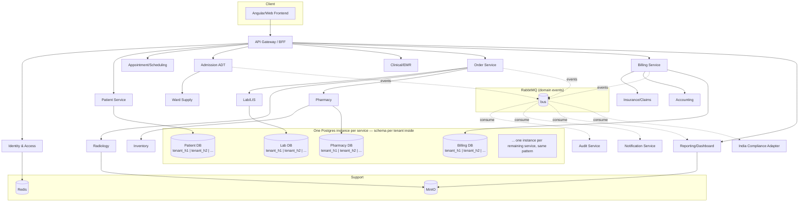

# PRD: Hospital Management EMR — Microservices Re-Platform

**Status:** Draft v1
**Source system:** `old/hospital-management-emr` (Danphe EMR — ASP.NET Core 2.0/net461 monolith, EF6/EF Core, MSSQL, Angular/TS frontend, ~40 modules, live in 50+ hospitals across India/Nepal/Bangladesh)
**Decisions locked in for this PRD:** stack = Node.js + NestJS + TypeScript across all services; scope = phased rollout, greenfield build; deployment = Docker Compose, **hybrid multi-tenant hosted (default) + single-tenant on-prem** (§9); tenancy isolation = schema-per-tenant within each service's own dedicated Postgres instance (§4).
**How `old/` is used:** `old/hospital-management-emr` is a reference for domain scope and known pain points only — not a parity contract. This is a greenfield design; services, boundaries, and even whether a given old module exists at all are free to change wherever the new design is better served by diverging.
**Target market:** India — this build is not for the old system's Nepal/Bangladesh markets. Country-specific compliance (§5.7) is scoped to India (GST, with ABHA/PM-JAY/ESI-PF as later additions), not Nepal.
**Confirmed scale & infra (2026-07-30 grilling session):** hosted multi-tenant mode targets **10-20 hospital tenants** on **one self-owned, in-house server hosted in India** (not a rented cloud VM) — see §9. Backend lives in one monorepo with affected-only CI/CD; frontend is a separate greenfield repo, framework TBD.

---

## 1. Problem Statement

Danphe EMR is a single ASP.NET Core deployable (`DanpheEMR.csproj`) referencing six shared component libraries (`Core`, `Security`, `ServerModel`, `DalLayer`, `AccTransfer`, `Sync`) with ~120 controllers across ~40 business modules, all against one MSSQL database pair (Admin-Db, EMR-Db). This produces:

- **Coupled deploys** — a Pharmacy fix requires redeploying Billing, Payroll, and Lab in the same binary.
- **Single DB contention** — Billing, Inventory, and Payroll all hammer the same MSSQL instance; no per-domain scaling.
- **Framework EOL risk** — net461/ASP.NET Core 2.0 and EF6 are out of support; `TargetFramework net461` + `EntityFramework 6.2.0` alongside `EntityFrameworkCore 2.0.0` is a legacy hybrid.
- **Country-specific logic baked into core** — `DanpheEMR.Sync` (IRD Nepal, SSF Nepal) and `MedicareModels` are compiled into the same deployable as generic clinical modules, blocking reuse in non-Nepal hospitals.
- **No clear bounded contexts** — `ServerModel` has 39 flat model folders (Billing, Lab, Radiology, Payroll, Fraction, CSSD, Vaccination, DICOM, …) with no enforced ownership boundary.

## 2. Goals / Success Criteria

| # | Goal | Success Criteria |
|---|------|-------------------|
| G1 | Independent deployability per domain | Each service ships its own container image and can be redeployed without touching others |
| G2 | Data ownership per bounded context | Each service owns a **dedicated Postgres database instance** (not just a schema); no cross-service direct SQL access whatsoever — access only via API/events |
| G3 | Reference-scope coverage, not parity | Every domain worth keeping from `old/` (see §5) has a named owning service in the target architecture — but modules can be merged, dropped, or redesigned where the old shape doesn't hold up |
| G4 | Dual deployment modes, one codebase | The identical service images run in a shared **multi-tenant hosted** deployment (many hospitals, one stack) or a **single-tenant on-prem** deployment (one hospital, one VM, as today) — the only difference is how many tenant schemas exist per service (§9) |
| G5 | Country-specific compliance isolated | India tax/regulatory logic (GST invoicing first; ABHA/PM-JAY/ESI-PF later) lives in a pluggable adapter service, not in core clinical services — isolated the same way even though every current tenant is Indian, so it stays replaceable if that ever changes |
| G6 | Phased build sequence | Services ship in dependency order (§8) so each phase is independently demoable/testable; no requirement to interoperate with the legacy `old/` app in production |
| G7 | Multi-tenant by default | New hospitals onboard as a schema in each service's existing Postgres instance, not a new stack — avoids re-provisioning infrastructure per customer (§9) |

## 3. Non-Goals

- Byte-for-byte replication of `old/` workflows or schemas — it's a reference for scope and lessons learned, not a spec to satisfy.
- Multi-region/multi-cloud active-active — out of scope; the hosted mode (§9.1) is one self-owned, in-house server in one location, not a distributed platform.
- Choosing a new frontend framework — confirmed greenfield rebuild (§8, not an evolution of the old Angular 7 app), but the specific stack is a separate decision outside this PRD; it lives in its own repo (§9.4).
- Hospital-chain / multi-site cross-hospital reporting — no chain customers among the confirmed 10-20 tenants; not designed for. Revisit only if a real chain customer appears (additive later, not a hard blocker now).
- Live migration between on-prem and hosted deployment modes — each hospital commits to one mode at deployment time; a mode switch is possible only as an ad hoc `pg_dump`/`pg_restore` (the schema shape is identical, §9.2), never a supported, tested, or SLA'd feature.
- ABHA/ABDM, PM-JAY, and ESI/PF integration — real India-market needs, but deferred past the GST-first India Compliance Adapter (§5.7) until specific tenants require them.

## 4. Target Tech Stack

| Concern | Choice | Notes |
|---|---|---|
| Service framework | NestJS (Node 20 LTS, TypeScript) | Built-in microservice transports (TCP/Redis/NATS/RabbitMQ/gRPC), DI, module boundaries map cleanly to bounded contexts |
| Sync inter-service calls | REST (via API Gateway) internally where simple; gRPC for high-frequency internal calls (Order → Lab/Radiology/Pharmacy) | Avoid chatty REST-over-REST for hot paths |
| Async/eventing | RabbitMQ | Order placed, bill settled, stock depleted, discharge summary ready, etc. Single broker per deployment keeps the footprint manageable, whether that deployment is the hosted stack or one on-prem VM |
| Database | PostgreSQL, **one dedicated Postgres instance per service** (database-per-service, not schema-per-service), and **within that instance, one Postgres schema per hospital tenant** | Two isolation axes, not one: service boundary = separate instance (G2); tenant boundary = separate schema inside it (G7). Tenant count never multiplies instance count — onboarding hospital #200 adds one schema to each of the ~36 existing instances, not 36 new containers |
| Tenant resolution | `hospitalId` JWT claim → schema name (`tenant_<hospitalId>`), resolved per-request by a shared `@hospital/tenant-context` middleware that sets the TypeORM/Postgres connection's `search_path` before any query runs | Same mechanism in both deployment modes (§9) — in on-prem single-tenant mode there's simply always one schema to resolve to |
| Cache/session | Redis | Session store for API Gateway auth, rate limiting, read-through cache for Master Data |
| Object storage | MinIO (S3-compatible) | DICOM images, PDF reports, Excel exports — replaces local filesystem writes the old app does under `wwwroot` |
| Auth | Identity & Access Service issuing JWT (access + refresh), RBAC claims ported from `DanpheEMR.Security/RBAC` | Gateway validates JWT; services trust gateway-forwarded claims over an internal network |
| API Gateway | NestJS gateway (or Kong/Traefik in front of a thin NestJS BFF) | Single ingress point per deployment (one hosted stack serving many hospitals, or one on-prem VM serving one); owns rate limiting, JWT validation, request routing |
| Containerization | Docker + Docker Compose | One `docker-compose.yml` per deployment — either the hosted multi-tenant stack or a single hospital's on-prem VM, per §9 |
| Observability | OpenTelemetry + Prometheus + Grafana + Loki, all in-stack alongside the services (hosted stack or on-prem VM alike) | Old system has no distributed tracing; this is a net-new NFR (see §10) |

## 5. Service Decomposition (informed by `old/` modules)

Each service below is one **DDD bounded context**: it owns its own aggregate roots, ubiquitous language, and persistence (a dedicated Postgres database per §4/G2), and is reachable only through its own API/events — no shared domain model, no shared database, no other service's code importing its entities. Grouped by domain, with the old-system source that motivates each boundary where one exists — this is a reference map, not a 1:1 port (G3); phase assignment is in §8.

### 5.1 Platform / Cross-Cutting Services

| Service | Old-system origin | Responsibility |
|---|---|---|
| **API Gateway / BFF** | `Controllers/*ViewController.cs` pattern (view-shaped aggregation endpoints) | Routing, JWT validation, request aggregation for UI-shaped views |
| **Identity & Access Service** | `DanpheEMR.Security` (RBAC), `AccountController.cs` | Login, JWT issuance, RBAC roles/permissions, session management — role model detailed in §6 |
| **Master Data Service** | `ServerModel/MasterModels`, `Core/Lookups`, `Core/Parameters`, `Controllers/Master`, `Controllers/Core` | Hospital-wide lookups: departments, wards, item catalogs, code tables |
| **System Admin Service** | `ServerModel/SystemAdminModels`, `Controllers/SystemAdmin` | Tenant/hospital config, module toggles, license, **tenant provisioning** — onboarding a new hospital publishes a `tenant.provisioned` event that every other service consumes to create its own `tenant_<hospitalId>` schema |
| **Notification Service** | `ServerModel/NotificationModels`, `Controllers/Notification`, SendGrid dep | Email/SMS dispatch, templated notifications |
| **Document & Print Service** | `Print/`, iTextSharp/EPPlus/Syncfusion/OpenXml deps, `ServerModel/StickerModels` | PDF generation, Excel export, label/sticker printing |
| **Reporting & Dashboard Service** | `ServerModel/ReportingModels`, `Controllers/Reporting`, `Controllers/Dashboard` | Cross-domain read-model aggregation, government reporting exports. Ships in two slices (§8): a minimal **event archiver** subscribing to the bus and persisting raw domain events from Phase 1 onward, and the full aggregation/dashboard UI querying that archive, in Phase 6 |
| **Audit Service** | `Audit.EntityFramework` / `Audit.NET.SqlServer` / `Audit.WebApi.Core` deps | Centralized audit trail consumer (subscribes to domain events) |

### 5.2 Patient & Care Delivery Services

| Service | Old-system origin | Responsibility |
|---|---|---|
| **Patient Service** | `ServerModel/PatientModels`, `Controllers/Patient` | Registration, demographics, patient master |
| **Appointment/Scheduling Service** | `ServerModel/AppointmentModels`, `SchedulingModels`, `Controllers/Appointment`, `Controllers/Scheduling`, `Controllers/Doctors` | Appointment booking, doctor schedules, visit summaries |
| **Admission (ADT) Service** | `ServerModel/AdmissionModels`, `Controllers/Admission` (incl. `DischargeSummaryController`) | Admission/discharge/transfer, discharge summaries |
| **Clinical/EMR Service** | `ServerModel/ClinicalModels`, `MedicalRecords`, `Controllers/Clinical`, `Controllers/MedicalRecords`, `Vaccination` | Clinical notes, vitals, medical records, vaccination records |
| **Nursing Service** | `Controllers/Nursing` | Nursing tasks, MAR (medication administration record) |
| **Emergency Service** | `ServerModel/EmergencyModels`, `Controllers/Emergency` | ER intake, triage |
| **OT (Operation Theatre) Service** | `ServerModel/OtModels` | Surgery scheduling, OT notes |
| **Maternity Service** | `ServerModel/MaternityModels` | Labor/delivery records |
| **CSSD Service** | `ServerModel/CSSD` | Sterile supply tracking (instrument lifecycle) |
| **Ward Supply Service** | `ServerModel/WardSupplyModels`, `Controllers/WardSupply` (incl. `SubstoreBL`) | Ward-level sub-store stock, requisition to Inventory |

### 5.3 Orders & Diagnostics Services

| Service | Old-system origin | Responsibility |
|---|---|---|
| **Order Service** | `Controllers/Order` (`OrdersController`, `OrderView`) | Central order placement, routes to Lab/Radiology/Pharmacy, order status |
| **Lab (LIS) Service** | `ServerModel/LabModels`, `LISModels`, `Controllers/Lab` | Test catalog, sample tracking, results, lab report export |
| **Radiology Service** | `ServerModel/RadiologyModels`, `Controllers/Radiology` | Imaging orders, report generation |
| **DICOM Service** | `ServerModel/DICOMModels`, `Controllers/DicomViewer` | DICOM image ingest/viewer integration (proxies to PACS) |

### 5.4 Pharmacy & Inventory Services

| Service | Old-system origin | Responsibility |
|---|---|---|
| **Pharmacy Service** | `ServerModel/PharmacyModels`, `Controllers/Pharmacy/*` (Sales, Credit, CreditNote, Rack, Dashboard), `Controllers/Dispensary` | Drug dispensing, sales, credit notes, rack/bin management |
| **Inventory Service** | `ServerModel/InventoryModels`, `Controllers/Inventory/*` | Stock, goods receipt, vendor/company master, inventory settings |
| **Fixed Asset Service** | `ServerModel/FixedAssetModels` | Asset register, depreciation |

### 5.5 Billing, Insurance & Finance Services

| Service | Old-system origin | Responsibility |
|---|---|---|
| **Billing Service** | `ServerModel/BillingModels`, `Controllers/Billing/*` (Billing, Deposit, Return, Settlement, IpBilling) | Charge capture, invoicing, deposits, settlements |
| **Insurance & Claims Service** | `ServerModel/InsuranceModels`, `ClaimManagementModels`, `MedicareModels`, `ExtReferralModels`, `Controllers/Insurance` | Government/private insurance verification, claims lifecycle, external referrals |
| **Accounting Service** | `ServerModel/AccountingModels`, `Controllers/Accounting/*`, `DanpheEMR.AccTransfer` | Ledger mapping, journal entries, financial reports |
| **Verification Service** | `ServerModel/VerificationModels`, `Controllers/Verification` | Payer/eligibility verification workflow |

### 5.6 HR & Payroll Services

| Service | Old-system origin | Responsibility |
|---|---|---|
| **Employee Service** | `ServerModel/EmployeeModels`, `Controllers/Employee` | HR records, employee master |
| **Payroll Service** | `ServerModel/Payroll`, `Controllers/Payroll` | Salary computation, payslips |
| **Fraction & Incentive Service** | `ServerModel/FractionModels`, `IncentiveModels`, `Controllers/Fraction`, `Controllers/Incentive` | Revenue-share/designation-based fraction calculation, doctor incentives |

### 5.7 Country-Specific Compliance (pluggable adapter)

| Service | Old-system origin | Responsibility |
|---|---|---|
| **India Compliance Adapter** | None — `old/` has no India-specific tax/health-ID logic to draw from (it only ever encoded Nepal's SSF/IRD sync, `DanpheEMR.Sync`/`Jobs`); this service is new domain knowledge, not a port. See the risk in §11 | GST-compliant invoicing support for Billing Service (Phase 1 scope, §8). ABHA/ABDM (national health ID linkage), PM-JAY (government insurance claims), and ESI/PF (payroll) are explicitly deferred (§3) — the adapter is structured to add each as its own module without touching Billing/Patient/Insurance/Payroll core logic |

> Structural point carried over from the old system's mistake, not from its solution: `DanpheEMR.Sync`/`Jobs` compiled Nepal-specific logic into every deployment regardless of country. The fix is the same pattern (one isolated, pluggable container, G5) even though — unlike Nepal in the old system, where some hospitals could opt out — **every current tenant is Indian, so this adapter is effectively mandatory for 100% of tenants today.** It stays a separate service purely so it remains swappable/removable if a non-Indian tenant is ever onboarded, not because it's actually optional right now.

### 5.8 Ancillary Services

| Service | Old-system origin | Responsibility |
|---|---|---|
| **Helpdesk Service** | `ServerModel/HelpdeskModels`, `Controllers/Helpdesk` | Internal ticketing |
| **Marketing & Referral Service** | `ServerModel/MarketingReferralModel` | Referral source tracking, marketing campaigns |
| **Social Service Unit Service** | `ServerModel/SocialServiceUnit`, `Controllers/SocialServiceUnit` | Charity/subsidized-care case management |

**Total: ~36 services** (consolidating ~40 old modules — several old modules merge into one service where they share a data lifecycle, e.g. Pharmacy Sales+Credit+Rack, or Fraction+Incentive).

## 6. Roles & Access Control Model (RBAC)

Ported from `DanpheEMR.Security/RBAC` (`RbacRole`, `RbacPermission`, `RbacUser`, `UserRoleMap`, `RolePermissionMap`, `RbacApplication`, `DanpheRoute`) — a many-to-many role↔permission, many-to-many user↔role model with permission-gated routes and a single `IsSysAdmin` bypass flag. Two deliberate departures from the old model:

1. **New role: Patient (self-service portal).** The old RBAC is staff-only — there is no patient-facing login in the existing controllers. Patient is a net-new role, and it's the first one that needs row-level scoping (to one `PatientId`) rather than just route/permission gating.
2. **Password storage fixed.** Old system uses `RBAC.EncryptPassword` — an MD5-derived-key 3DES cipher with a static hardcoded salt (`"Danphesalt"`), i.e. reversible encryption, not hashing. The target Identity & Access Service must use bcrypt/argon2id (one-way, per-user salt). This is a security fix, not a parity requirement.

### 6.1 Roles

| Role | Scope | Full access (read/write) | Read-only |
|---|---|---|---|
| **Super Admin** | Cross-hospital (vendor/ops) | System Admin, Identity & Access | All services (support/debug), across **every** tenant on the platform |
| **Hospital Admin** | Single hospital tenant | System Admin, Identity & Access, Master Data | All services within the hospital |
| **Receptionist / Front Desk** | Single hospital | Patient, Appointment/Scheduling, Billing (charge capture, deposits) | — |
| **Doctor** | Single hospital, own department/patients | Clinical/EMR, Order Service, Appointment/Scheduling, Admission (ADT) | Lab, Radiology, Pharmacy (results/status) |
| **Nurse** | Single hospital, assigned ward | Nursing, Clinical/EMR (vitals/MAR), Admission (ADT), Ward Supply | Order Service (status) |
| **Lab Technician** | Single hospital | Lab/LIS | Order Service, Patient (demographics only) |
| **Radiology Technician** | Single hospital | Radiology, DICOM | Order Service, Patient (demographics only) |
| **Pharmacist** | Single hospital | Pharmacy | Inventory, Order Service |
| **Billing/Accounts Staff** | Single hospital | Billing, Insurance & Claims, Accounting, Verification | Patient (demographics) |
| **Inventory/Store Manager** | Single hospital | Inventory, Ward Supply, Fixed Asset | — |
| **HR/Payroll Admin** | Single hospital | Employee, Payroll, Fraction & Incentive | — |
| **Helpdesk Agent** | Single hospital | Helpdesk | — |
| **Auditor/Compliance** | Single hospital | — | Audit Service, Reporting/Dashboard |
| **Patient** *(new)* | Own record only | Patient (own profile), Appointment/Scheduling (own bookings) | Billing (own invoices), Lab/Radiology (own reports) |

A user may hold multiple roles at once (e.g. a doctor who also covers OT), matching the old system's many-to-many `UserRoleMap` — the target Identity & Access Service keeps this many-to-many model rather than collapsing to one-role-per-user.

### 6.2 Enforcement Model

- **Coarse-grained (route-level):** the JWT issued by Identity & Access Service carries `roles[]`, `permissions[]`, `hospitalId` (tenant), and — for the Patient role only — `patientId`. The API Gateway validates the JWT and checks route-level permission before proxying, the direct equivalent of the old `DanpheRoute`/`RbacPermission` gating.
- **Fine-grained (resource-level):** each service enforces its own row-level checks from the same claims (e.g. Patient can only call `GET /patients/{id}` where `id == jwt.patientId`; Nurse can only write vitals for patients on their assigned ward). This is a shared internal library (`@hospital/auth-guards` — NestJS guards/decorators) imported by every service, not a dedicated network-hop "authorization service" — keeps permission checks in-process on the request path.
- **Cache invalidation:** role/permission changes publish an `rbac.changed` event on RabbitMQ; each service's short-TTL Redis cache of a user's permissions (mirroring the old `DanpheCache` pattern in `RBAC.cs`) invalidates on that event instead of polling.
- **Multi-tenancy:** the `hospitalId` claim drives schema resolution (§4) — every query a hospital's users make runs against `tenant_<hospitalId>` only, so one hospital's staff can never see another's data even though they share the same Postgres instance per service. Super Admin is the one role not pinned to exactly one `hospitalId`, and may switch schema context across any tenant on the platform for vendor support/ops purposes.

## 7. Architecture Overview



**Key rules:**
- All UI traffic enters through the **API Gateway**; no service is directly internet-facing.
- **Synchronous** calls (Order → Lab/Radiology/Pharmacy at order-placement time) use gRPC.
- **Asynchronous** side effects (billing on order completion, audit logging, notifications, GST compliance sync) go through RabbitMQ — this is the direct fix for the old system's tight in-process coupling (e.g. billing logic invoked inline from clinical controllers).
- Each service has its **own dedicated Postgres instance**, own credentials, own connection string; cross-domain reads go through the owning service's API, never direct SQL. There is no shared instance for a *service* boundary to leak across — that isolation is physical.
- Within a service's instance, **tenants are separated by schema**, resolved per-request from the `hospitalId` JWT claim (§4, §6.2) — this is a logical, not physical, boundary, so it is enforced with Postgres role-level schema grants (a tenant's DB role can only reference its own schema) rather than relying on application code alone.
- **A service's instance may have two layers, not one.** Most services are pure schema-per-tenant, but where a service has genuinely platform-wide data — a bootstrapping registry that must exist *before* any tenant schema does (System Admin's tenant registry), or reference data identical for every hospital that shouldn't be duplicated per tenant (Master Data's ICD10/geography tables, Identity & Access's fixed RBAC role/permission catalog per §6.1) — that service also maintains one platform-level, non-tenant-scoped set of tables alongside its per-tenant schemas. This is a deliberate, stated exception decided per-service in that service's own design spec (`docs/superpowers/specs/`), not a general license to share data; cross-*service* database access remains forbidden absolutely (G2).

## 8. Phased Build Sequence

Greenfield build — there is no production `old/` instance to interoperate with or migrate off of. Phasing exists purely for engineering sequencing: each phase is a deployable, demoable increment, ordered by dependency (e.g. Order Service must exist before Lab/Radiology/Pharmacy can receive orders) and by business value (registration → visit → bill proves the core loop first).

| Phase | Services | Rationale |
|---|---|---|
| **Phase 0 — Foundations** | API Gateway, Identity & Access, Master Data, **System Admin** (owns tenant provisioning — publishes `tenant.provisioned`, consumed by every service for per-service schema bootstrap), Audit Service | Every other service depends on auth, master data, gateway routing, and tenant schema provisioning existing first — without System Admin Service itself shipping in this phase, no service has anywhere to write a new hospital's data |
| **Phase 1 — Core Clinical + Revenue** | Patient, Appointment/Scheduling, Admission (ADT), Billing, Order Service, **Reporting/Dashboard (event archiver only)**, **India Compliance Adapter (GST scope)** | Highest-value modules; proves the pattern end-to-end (registration → visit → bill). The archiver ships alongside these because Order/Billing/ADT start publishing events immediately — without a consumer live from Phase 1, that history is unrecoverable by the time the full dashboard ships in Phase 6. GST moves up from a "country compliance" afterthought to Phase 1 because Billing cannot legally issue invoices in India without it — it isn't optional the way it would be for a genuinely pluggable country adapter |
| **Phase 2 — Diagnostics & Pharmacy** | Lab, Radiology, DICOM, Pharmacy, Inventory, Ward Supply | Depends on Order Service from Phase 1 |
| **Phase 3 — Finance & Insurance** | Insurance/Claims, Accounting, Verification, Fixed Asset | Depends on Billing from Phase 1 |
| **Phase 4 — Clinical Long Tail** | Clinical/EMR, Nursing, Emergency, OT, Maternity, CSSD | Lower transaction volume, can build at leisure |
| **Phase 5 — HR & Compliance** | Employee, Payroll, Fraction & Incentive | Isolated from clinical workflow; safe to do last. (India Compliance Adapter itself moved to Phase 1, §8 — GST is a Billing-blocking legal requirement, not deferrable HR/payroll-adjacent scope; ESI/PF payroll compliance is deferred per §3, revisited only when a tenant needs it) |
| **Phase 6 — Ancillary + Reporting** | Helpdesk, Marketing & Referral, Social Service Unit, Notification, Document & Print, **Reporting/Dashboard (full aggregation/UI, reading the Phase-1 archive)** | Long-tail modules; the dashboard/query layer lands last since it aggregates data from every other service, but it's reading history the archiver (Phase 1) has been collecting all along — no backfill gap |

**Phase 0 detailed designs:** all five Phase 0 services now have approved, committed design specs in `docs/superpowers/specs/` (2026-07-30), covering schema, event contracts, and stated departures from the old system in more detail than this section does. Later phases should follow the same process before implementation.

## 9. Deployment Model (Hybrid: Multi-Tenant Hosted + Single-Tenant On-Prem)

Both modes run the **same container images**; the only difference is how many tenant schemas exist per service and where the Compose stack physically runs.

### 9.1 Multi-tenant hosted (default)

One Compose stack, run on **one self-owned, in-house server hosted in India** — not a rented cloud VM, and not a cluster (Docker Compose doesn't orchestrate across multiple machines; that's explicitly not in scope, §9.3). India hosting is a hard requirement here, not a preference: patient health data plus the GST/ABHA/PM-JAY integration surface (§5.7, §3) make in-country, self-owned infrastructure the only sensible option for this customer base. Confirmed target is **10-20 hospital tenants** on this one machine — comfortably within a single well-specced server's capacity (see §11 for the headroom analysis), so the Swarm/Kubernetes question that a larger tenant count would force is explicitly not a near-term concern.

```
hosted-stack/
  docker-compose.yml         # one file, one `docker compose up -d`, serves all onboarded hospitals
  .env                       # platform-wide secrets; per-tenant config lives in DB, not .env
  volumes/
    postgres-patient-data/   # tenant_h1, tenant_h2, ... schemas inside
    postgres-billing-data/
    postgres-<service>-data/ # one data dir per service's Postgres instance, many schemas inside
    minio-data/               # objects namespaced by hospitalId prefix
    rabbitmq-data/
```

- **One dedicated Postgres container per service** (~35 instances total, regardless of tenant count — API Gateway/BFF is a stateless proxy with no Postgres instance of its own, per its Phase 0 design spec), each holding one schema per onboarded hospital.
- Onboarding hospital #N: System Admin Service creates the tenant record and publishes `tenant.provisioned`; every service consumes it and runs its migration set against a new `tenant_<hospitalId>` schema (§5.1, §8 Phase 0). No new containers, no redeploy.
- MinIO objects and RabbitMQ routing keys are namespaced by `hospitalId` so tenants share the broker/object store without cross-tenant visibility.
- India Compliance Adapter runs as one shared container processing every tenant schema — since all confirmed tenants are Indian, there's currently no `country` flag gating it the way the old Nepal-only toggle worked; it's effectively always-on, kept as a separate service only so it stays swappable if that ever changes (§5.7).

### 9.2 Single-tenant on-prem (opt-out)

For hospitals that need dedicated/air-gapped infrastructure (matches the old system's 50+ on-prem installs) — identical images, identical schema-per-tenant mechanism, just with exactly one tenant schema (`tenant_<thisHospitalId>`) ever created per service.

```
hospital-vm/
  docker-compose.yml         # same compose file as §9.1, DEPLOY_MODE=single-tenant
  .env                       # this hospital's secrets, feature toggles
  volumes/                   # same layout as §9.1, one tenant schema per service instead of many
```

- Same ~36 Postgres instances, same tenant-resolution middleware (§4) — it simply always resolves to the one schema that exists.
- Moving a hospital between modes is possible only as an ad hoc `pg_dump`/`pg_restore` (the schema shape is identical) — not a supported, tested, or SLA'd feature (§3).

### 9.3 Shared operational notes

- A single **PgBouncer** (or per-service NestJS pool config) fronts connections to keep per-instance connection counts sane — relevant in both modes, more so in hosted mode where connection counts scale with tenant count, not just service count.
- Services are stateless containers; horizontal scale-out (multiple replicas of e.g. Billing) is possible via Compose `deploy.replicas` if the host has spare cores, without needing Kubernetes.
- **Capacity planning:** the hosted mode pays the ~36-Postgres-instance resource floor once and amortizes it across up to 10-20 onboarded hospitals; the on-prem mode pays that same floor per hospital. Confirmed scale keeps this comfortable — see §11.
- **In-house hosting has no cloud-provider redundancy:** unlike a rented cloud VM, a self-owned server has no vendor-managed live migration, auto-restart-on-host-failure, or storage replication underneath it. A hardware fault on the hosted-mode machine is a real outage, not something the cloud provider absorbs — see §11 for the mitigation.
- **Backups are offsite, not just on-VM:** per-service `pg_dump`/WAL archives are synced daily to storage physically separate from the hosted server (a second location, not the same in-house machine's disk) — see §10. This applies to both deployment modes; on-prem hospitals need their own offsite target too.

### 9.4 Engineering Workflow (Repo, CI/CD, Testing)

- **One backend monorepo** (Nx or Turborepo, pnpm workspaces) holds all ~36 services plus shared internal libraries (`@hospital/auth-guards`, `@hospital/tenant-context`, etc.) as workspace packages — not 36 separate repos with published npm packages. The frontend is a **separate repo**, greenfield, framework TBD outside this PRD (§3).
- **Affected-only CI/CD:** each commit rebuilds and redeploys only the container images for services actually touched, using the monorepo's dependency graph (Nx `affected` / Turborepo `--filter`). A change to a shared library like `@hospital/auth-guards` correctly triggers every service that imports it; a Billing-only fix redeploys just Billing.
- **Contract tests as a CI gate:** every gRPC/REST boundary between services (Order → Lab/Radiology/Pharmacy, §4) carries consumer-side tests asserting the shape of the contract it depends on, run as part of the affected-build graph. A breaking change to a producer service's contract fails CI in the consumer's test suite, not in production — this is what makes affected-only deploys (previous bullet) safe rather than a way to silently ship broken integrations.

## 10. Non-Functional Requirements

| NFR | Target | Notes |
|---|---|---|
| Availability | 99.5% during hospital operating hours | Old system has no documented SLA; this is new baseline the architecture must support (per-service restart shouldn't take down Billing while Payroll redeploys) |
| Observability | OpenTelemetry traces + Prometheus metrics + centralized logs, all self-hosted on the VM | Old system has none of this — net-new requirement, not parity |
| Data isolation (service) | Physical isolation — separate Postgres instance and credentials per service | Prevents the old system's "any controller can query any table" pattern; stronger than schema-level role grants since there's no shared instance to misconfigure |
| Data isolation (tenant) | Logical isolation — Postgres role-level schema grants so a tenant's DB role can reference only its own `tenant_<hospitalId>` schema | Enforced at the database layer, not just application code, so a bug in the tenant-resolution middleware can't leak another hospital's rows |
| Tenant onboarding time | New hospital tenant provisioned (schema created + migrated in all ~36 services) in under 5 minutes, no downtime for existing tenants | Direct measure of G7 — onboarding must not require a redeploy or maintenance window |
| Backup/restore | Per-service backup job (`pg_dump`/WAL archiving), restorable per-service or per-tenant-schema independently, **synced daily to offsite storage** physically separate from the hosted server (§9.3) | A service or a single hospital's data can be restored to a point in time without touching any other service or tenant; the offsite copy is what actually protects against losing the one in-house machine itself, not just a bad deploy |
| Data residency | All patient/tenant data hosted in India, on self-owned infrastructure — no cross-border transfer | Driven by DPDP Act expectations, ABDM/NHA norms, and hospital accreditation requirements for the confirmed India market (§1 header) |
| Security | JWT + RBAC per §6, secrets via `.env`/Docker secrets (not committed) | Old `App.config`/`appsettings.json` pattern must not be replicated as-is (no plaintext connection strings in images); password hashing must be bcrypt/argon2id, not the old reversible MD5+3DES scheme |
| API stability | Gateway API contract stable within a phase once shipped; every gRPC/REST inter-service boundary covered by a consumer-side contract test in CI (§9.4) | Whatever frontend consumes it (rebuilt or new, §3) shouldn't need a rewrite every time a later phase ships, and a producer service can't silently break a consumer it wasn't deployed alongside |

## 11. Risks & Devil's-Advocate Review

| Risk | Argument against this design | Mitigation |
|---|---|---|
| **Over-decomposition for single-VM ops** | 36 services on one VM is a lot of container overhead for what's still fundamentally single-tenant, single-machine software — a modular monolith could achieve G1–G3 with far less operational complexity (no network hops, no distributed tracing needed) | Explicitly revisit after Phase 1: if per-service overhead dominates VM resources, consolidate low-traffic domains (§5.6, §5.8) into fewer deployable units before Phase 4–6 |
| **True DB-per-service multiplies resource and ops overhead per deployment** | 36 separate Postgres processes each carry a fixed memory/CPU floor even when nearly idle (e.g. Helpdesk, Marketing & Referral); 36 separate backup jobs and connection pools are more to operate than one instance with 36 schemas — chosen deliberately over the lighter schema-per-service option for stronger isolation, but it is a real cost, not a free upgrade. Hosted mode (§9.1) amortizes this floor across all tenants; on-prem mode (§9.2) pays it per hospital | Tune each Postgres container's `shared_buffers`/`max_connections` down for its actual load; front with PgBouncer (§9.3); capacity-plan for the full 36-instance floor before Phase 1 rollout, not after — and steer new on-prem customers toward hosted mode where the cost is shared, unless they specifically need dedicated infra |
| **Cross-service transactions get harder** | Real DB-per-service means no cross-service DB transaction is possible even for closely related writes (e.g. Order Service marking an order fulfilled + Billing creating the charge) — a shared-schema design could have used one local transaction | Use the outbox pattern + RabbitMQ for cross-service consistency (already required for async side effects, §7); design each cross-service workflow as an explicit saga up front rather than assuming transactional consistency |
| **Hosted mode has a single-machine ceiling** (was "unquantified" — now scoped) | Confirmed target is 10-20 tenants (§9.1), which is comfortably within one well-specced server's capacity — but the ceiling still exists and isn't load-tested yet | Load-test the reference server spec against 20 tenants' worth of realistic load before the first hosted onboarding, not after; treat "need more than ~20" as a known future trigger for re-evaluating Swarm/Kubernetes, not an emergency |
| **Noisy-neighbor tenant in hosted mode** | All hospitals share one Postgres instance per service (§9.1) — one tenant's heavy Lab report query or bulk import can degrade query latency for other tenants on that same Lab instance. Lower-stakes at 10-20 tenants than at platform scale, but not zero | Per-tenant statement timeouts and connection-pool caps at the PgBouncer layer; per-tenant query metrics (§10 Observability) with alerting so a noisy tenant is caught before it pages everyone |
| **Schema-per-tenant migration fan-out** | A DDL migration that's instant against one schema must run once per tenant schema in hosted mode. At the confirmed 10-20 tenants this is a minor, sequential-and-fine operation — the original framing (200+ tenants) overstated it | Iterate tenant schemas in the migration runner from day one (Phase 0, §8) so the pattern is already correct if tenant count grows later; no need for sophisticated per-schema locking/retry infrastructure at this scale |
| **In-house single-machine hosting has no cloud-provider redundancy** | A self-owned, in-house server (§9.1) has no vendor-managed live migration, host auto-failover, or storage replication under it — a hardware fault is a real outage, unlike a rented cloud VM | Offsite daily backups (§9.3, §10) as the primary safety net; keep spare hardware or a documented rebuild runbook on hand so a failed machine is a same-day recovery, not an open-ended one |
| **RabbitMQ single point of failure** | One broker container on one machine means a broker crash stalls all async workflows (billing events, audit, notifications) hospital-wide | Accepted trade-off at this scale: `restart: unless-stopped`, durable queues + publisher confirms so in-flight messages survive a restart, and the outbox pattern for Billing so a broker outage degrades to "events delayed," not "events lost." Full clustering (quorum queues) deferred unless scale ever forces the Swarm/Kubernetes question above |
| **No `old/` reference for India compliance** | Every other service in §5 has old-system code to read for non-obvious business rules (§8 Phase 5 note). India Compliance Adapter (§5.7) has none — `old/` only ever encoded Nepal's SSF/IRD logic, verified by grep, zero GST/ABHA/PM-JAY code anywhere. This is genuinely new domain knowledge, not archaeology | Budget real research time against actual GST invoicing rules (and later ABHA/PM-JAY/ESI-PF specs, §3) before finalizing Billing's GST fields in Phase 1 — treat this service's spec as needing external regulatory sourcing, not a code-reading pass |
| **Greenfield freedom drops hard-won edge cases** | `old/` is 15+ years of production hospital use encoding non-obvious regulatory/billing/clinical edge cases (insurance settlement quirks, billing corrections) in code, not docs. Treating it as "inspiration only" risks silently losing rules nobody remembers to ask about | Where a service's design touches regulatory or financial calculation logic that *does* exist in `old/` (Insurance & Claims, Accounting, Payroll — not India Compliance Adapter, which has no old-system counterpart per the risk above), read the corresponding `old/` `*BL.cs` business-logic files before finalizing that service's spec, and record any non-obvious rule kept or deliberately dropped as an ADR |

## 12. Open Questions

**Resolved (2026-07-29):**
- ~~Data migration from old MSSQL schemas~~ — moot; this is a greenfield build, not a migration off `old/`.
- ~~Patient self-service portal in scope?~~ — yes; Patient is a first-class role in §6.1, free to design regardless of the old system lacking one.
- ~~Multi-tenancy~~ — yes; hybrid hosted (multi-tenant, schema-per-tenant) + on-prem (single-tenant) model, §9.

**Resolved (2026-07-30 grilling session):**
- ~~Hosted-mode scale~~ — confirmed target: 10-20 tenants on one self-owned, in-house, India-hosted server (§9.1). Not a near-term Kubernetes/Swarm question.
- ~~Cross-hospital HQ reporting for chains~~ — no chain customers exist; cut from scope entirely (§3), not just deferred.
- ~~Tenant onboarding ownership~~ — internal ops-only, no public signup surface (§9.1, §3).
- ~~On-prem ↔ hosted migration~~ — explicitly not a supported feature (§3); possible only as an ad hoc, unsupported schema dump/restore.
- ~~Frontend: rebuild or reuse Angular?~~ — greenfield rebuild confirmed (old app is Angular 7.1.0, pre-Ivy, effectively EOL); specific stack still deferred to a separate repo/PRD (§3, §9.4).
- ~~Country/compliance target~~ — India, not Nepal. India Compliance Adapter replaces the old Nepal-specific one, GST-first (§5.7), with ABHA/PM-JAY/ESI/PF explicitly deferred (§3).
- ~~Data residency / hosting location~~ — India-hosted, self-owned in-house infrastructure required, not a rented cloud VM (§9.1, §10).
- ~~Repo & CI/CD strategy~~ — one backend monorepo + separate frontend repo, affected-only builds, contract-testing CI gate (§9.4).
- ~~RabbitMQ resilience~~ — single broker accepted at this scale; mitigated via restart policy, durable queues/publisher-confirms, and the outbox pattern rather than clustering (§11).
- ~~Backup destination~~ — offsite/off-VM required in both modes, not just an on-machine backup volume (§9.3, §10).

**Still open:**
1. Exact reference server spec for the hosted VM (CPU/RAM/disk) — needs the load test called out in §11's single-machine-ceiling risk before the first hosted onboarding. **Tension with the resolved decision above (2026-07-30):** a mid-tier Hostinger VPS (4-8 vCPU, 16-32GB RAM, India region — satisfying §10's data-residency requirement) is now under active consideration/use, which directly conflicts with §9.1/§10's locked-in "self-owned in-house server, not a rented cloud VM." Product design/development is the stated current priority; infra sizing and the final self-owned-vs-rented-VPS choice are explicitly deferred until after the initial build, with all services running as plain Docker containers in the interim. The ~35-Postgres-instance resource floor (§9.1, §11) is tight against this VPS tier's RAM ceiling and has not been load-tested — this needs a real decision before first hosted onboarding, not just before "the load test."
2. Timeline/trigger for ABHA/PM-JAY/ESI-PF phases of India Compliance Adapter (§3, §5.7) — deferred, but not yet scheduled against any specific tenant's needs.
3. Hardware-failure runbook for the in-house server (§11) — offsite backups are required, but the actual recovery procedure (spare hardware on hand? vendor support contract? rebuild time target?) isn't specified yet. Moot if the Hostinger-VPS direction above is finalized instead of a self-owned server (a rented VPS shifts hardware-failure recovery to the provider's own infrastructure guarantees, not a runbook this team maintains) — pending item 1.
4. Local/CI development stack composition — whether engineers run the full ~35-service `docker-compose` stack locally per PRD §9.4, or only a subset scoped to the service under work. Not yet decided; affects Phase 0 developer experience directly.
